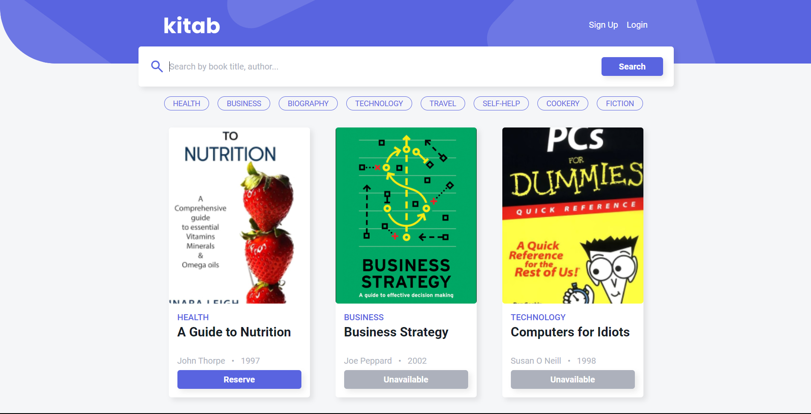
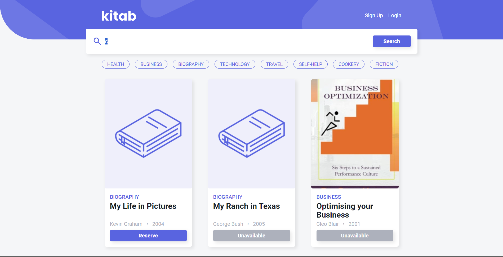
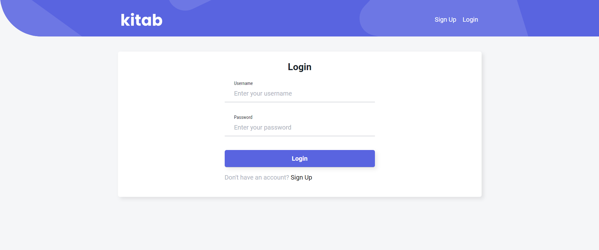
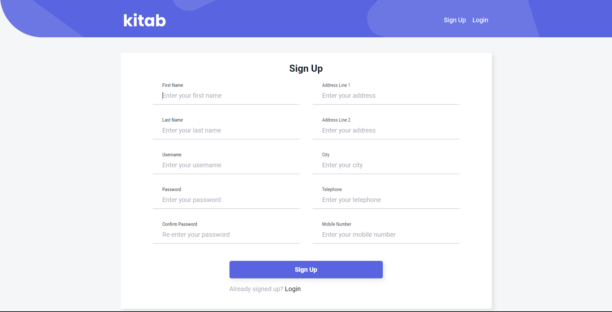

# 📚 Kitab

🌐 Website: https://kitab-webapp.vercel.app/

## Simplex Framework

For this project, I build my own custom PHP framework called [Simplex](https://github.com/A-ElMahmi/kitab-webapp). Simplex uses the Model-View-Controller (MVC) design pattern. All requests are routed through it, it processes the request and calls the necessary Controller to return a response. Simplex has 3 main modules: `Simplex\Simplex`, `Simplex\Blade`, `Simplex\Form`

`Simplex\Simplex`:

- Parses all user-defined dynamic routes in `app/routes.yaml`
- Matches the request URL with a defined route
- Calls the controller linked to the route

`Simplex\Blade`:
Blade is Laravel's template engine. It could be used as a standalone library.

- Compiles user-defined view templates (found in `app/views`) to plain php

`Simplex\Form`:

- Removes client-side validation from forms
- Keeps input values persistent after form submission
- Validates form input
- Allows user to add custom constrainsts to inputs
- Adds `<small class="error">` after every input with error messages

## Project Structure

- `app/`: Main directory with all the Models, Views & Controllers
- `public/`: All static resources
- `lib/`: Simplex Framework files
- `api/`: Simplex Front Controller
- `vendor/`: External libraries

## Pages

All page templates extend `app/views/layout.php`. Layout.php contains a common header and footer for every. The header has a navbar which displays links to login and signup if they user isn’t logged in or account and logout if the user is logged in. 
